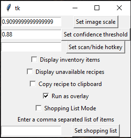
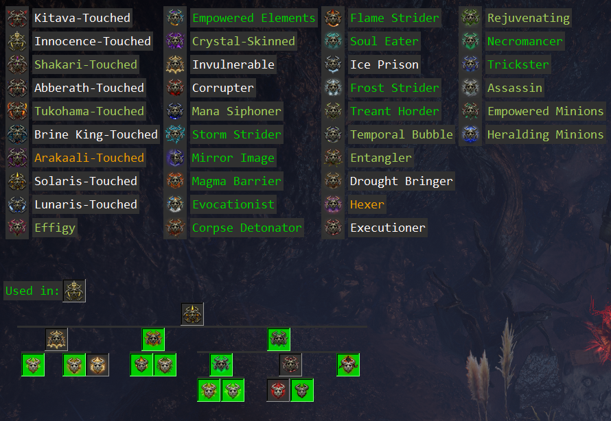

# poe-archnemesis-scanner
Tool for Path of Exile game to automatically scan Archemesis inventory and display related information

## Features

### Controls
When you start the program three small buttons will pop up in the top left corner of your screen.


* '[X]' button just closes the program.
* 'Settings' button open settings window (see below).
* 'Scan' button does all the magic. Once you press it, the program will enter the scanning mode and the button will change to 'Scanning...'. It will scan your archnemesis inventory and will create a list of all possible recipes. After the scan completes, the button will change again to 'Hide'. Once you examine the scan result, click the 'Hide' button to hide them.

You could also hold the right mouse button to drag the controls around.

### Settings

The setting window allows you to adjust some parameters to improve the searching efficiency or change the display settings:



* 'Set image scale' button sets the scaling factor for the source images. The current search algorithm expects the source image and the image on the screen to be the same size. Thus, we'll need to scale down/up the source images in order to get reliable results.

  The default calculated automatically based on the screen resolution and should work for most of the people. However, if you have some non-standard resolution, the search algorithm may not work properly, so you'll need to adjust this parameter manually.
  
* 'Set confidence threshold' button sets the threshold used by the search algorithm to filter the results. If the algorithm was able to find an area with confidence value higher than the confidence threshold then it will treat it as a match. The default value is 0.94 (or 94%) and should work in most of the cases.

* 'Set scan/hide hotkey' button sets the keyboard hotkey for the 'Scan'/'Hide' button. It accepts a text that represents a hotkey and its modifiers. Examples: 'F11', 'ctrl+shift+s', 'space', 'comma', 'plus', etc.

* 'Display inventory items' checkbox turns additional display setting for scan window. The scan results will also include a list of all of your archnemesis items in the inventory.

* 'Display unavailable recipes' checkbox turns the display of all possible recipes even if you can't currently build them. The unavailable recipes will be indicated by the white color (light green if you already have it in your inventory).

* 'Copy recipe to clipboard' checkbox copies a recipee string like `^(Malediction|Deadeye)` to your clipboard when clicking on items in the list or tree views. This allows you to paste into the search box and use the in-game highlighting.

* 'Run as overlay' checkbox allows you to run the program as the overlay (default) or as a simple window (scan results will still show up on top of the other windows). This is useful with scan hotkey feature to allow you to completely hide the program and rely only on hotkey to show up the scan results.

* 'Shopping List Mode' checkbox tells the program to filter the recipes based on your shopping list parameter. The trash icon will also occur to display the recipes that are not in the list but could be completed.

* 'Set shopping list' button will save your recipe list. When the scan completes, only the recipes in your shopping list, and the recipes needed to create these recipes, will show up. The form has a strict format. You will need to enter the recipes names separated by commas, keeping the right letter case.

The settings are persistent and will be saved/loaded from settings.ini file.

### Scan results
The scan result will be displayed at the top of the screen like that:


It shows you all available recipes that you can create right now. If the text is green, then that means you already have such item in the inventory. If the text is orange, then this item doesn't exist in your inventory.

You could then hover over any of the recipes to highlight the items in your inventory that could be combined to create it:


If you checked 'Display inventory items' box, then your scan results will also include a list of all of your items in inventory (colored in white):


Again, hover over any items to display them in your inventory.

If you checked 'Display unavailable recipes' box, then your scan results will also include the recipes that you cannot complete right now. This is useful for planning the next step especially with the next feature.

If you click at any recipe icon, then the recipe tree will open:



If the icon is highlighted in green, then that means you have this item in your inventory. You could hover of highlighted items to display them in your inventory. The tree is also interactable. You could click at other nodes to zoom in.

Above the tree, a list of recipes (next to 'Used in:') that the selected recipe could be used in will be displayed

Both recipe list and recipe tree could be also moved with the right mouse button held.

## Installation

### Standalone
You could download a standalone version from release page: https://github.com/4rtzel/poe-archnemesis-scanner/releases. The package was created using `pyinstaller`.

### Manual
You'll need to install Python and all project dependencies. Python could be installed from Microsoft Store and from the main site: https://www.python.org/downloads/ (doesn't include `pip`, so you'll have to install it separately).

Once the Python and pip are installed, run this command from the project directory to install all project dependencies:

```cmd
pip.exe install -r requirements.txt
```

and then start the program

```cmd
python.exe src/poe_arch_scanner.py
```

## Known Issues

* Doesn't work if the game is in the fullscreen.
* Only works for the primary monitor (Tk limitation).
* Occasionally hangs.

## Other languages
Chinese -- https://github.com/njes9701/poe_arch_scanner_zh_tw
